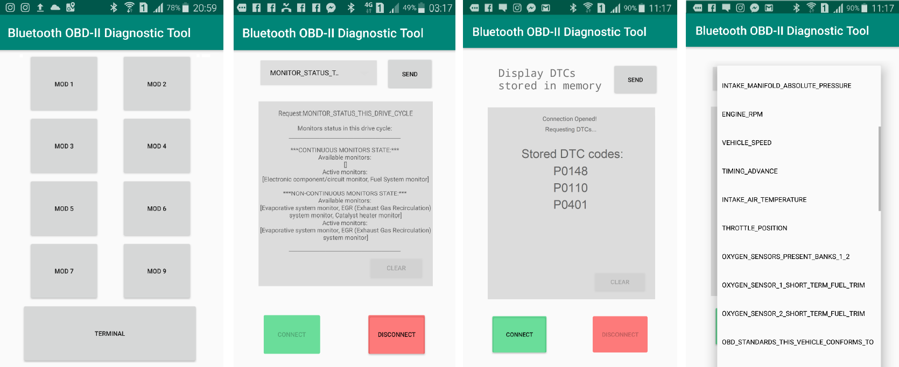
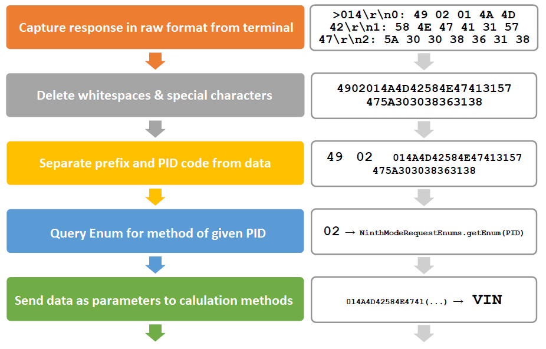
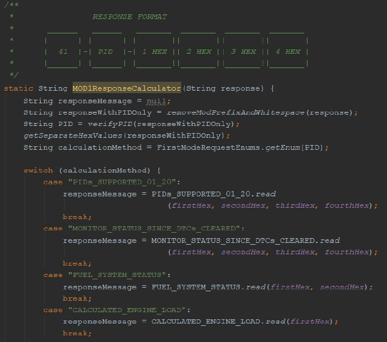
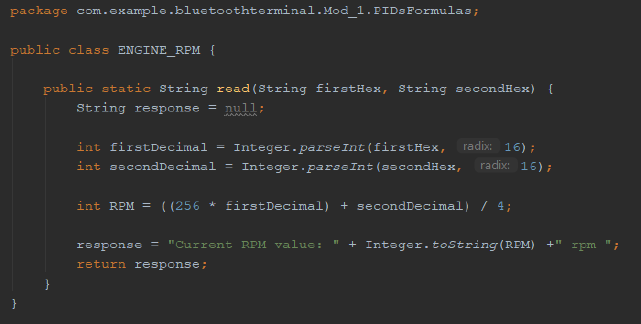
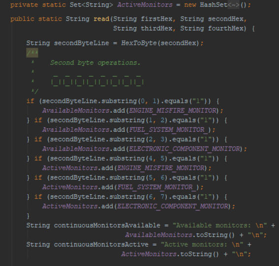
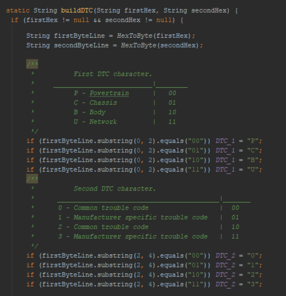
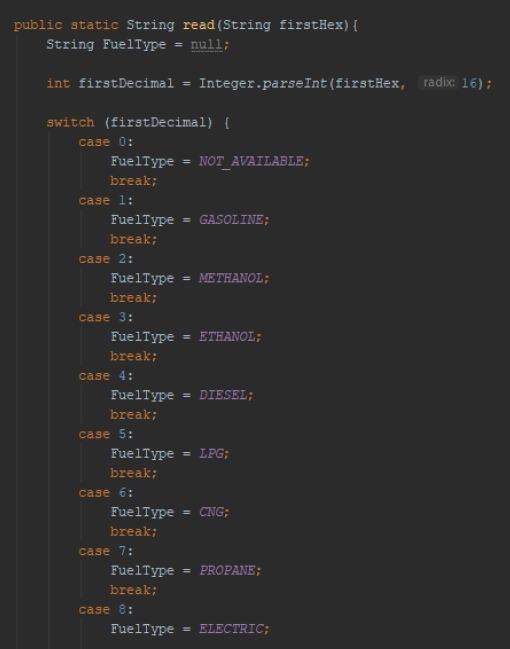
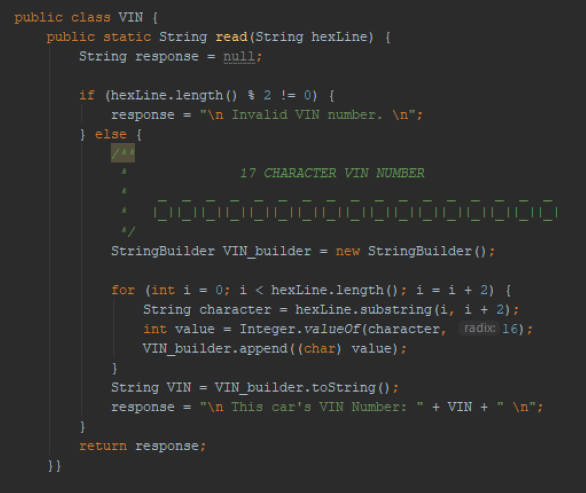
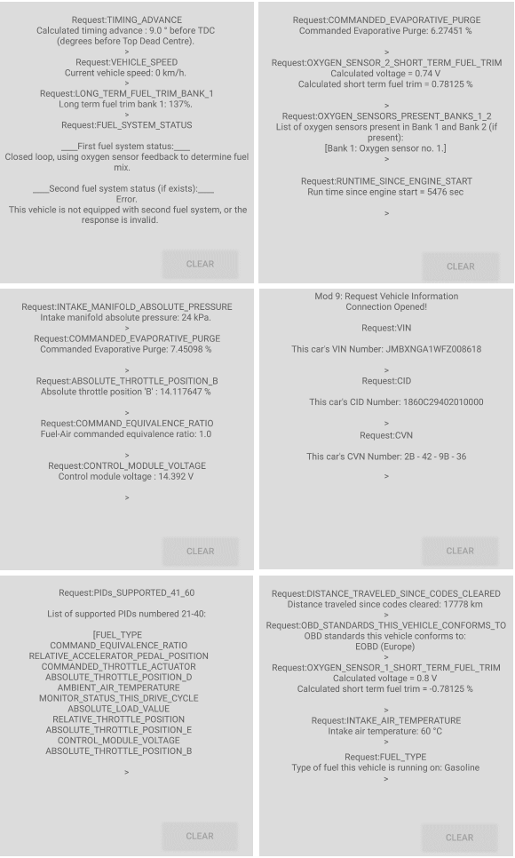

# Bluetooth OBD-II Diagnostic Tool

The aim of this project was to create an Android application capable of connecting via a Bluetooth adaptor to the OBD2 car diagnostic socket (in vehicles supporting this protocol) and serve the communication with car's ECU. Application is capable of deciphering, formatting and visualising most of the signals generated by the ECU in real time, as well as providing support to all of the OBD operating modes. To test its functionality, multiple test runs were performed on 2016 Mitsubishi ASX, 2005 Fiat Panda and 2004 Seat Leon.

https://en.wikipedia.org/wiki/OBD-II_PIDs

This project was done using [Android Studio](https://developer.android.com/studio).

## Screen captures from the App
 

## Running the application
The application is available for install via the built .apk file in the main directory. To connect with car's ECU, an OBD-2 **ELM327 Bluetooth adapter** is needed. [**ELM327**](https://www.elmelectronics.com/wp-content/uploads/2016/07/ELM327DS.pdf) is a ELM Electronics microcontroller designed to translate the signals generated by SAE J1962 diagnostic socket into a byte stream. A standard single message transmitted by the adapter is encoded in 4 bytes long message, called OBD frame. Each byte in the frame has different meaning, an in-depth overwiev of bit-wise OBD frame decryption can be found in the relevant [Wikipedia](https://en.wikipedia.org/wiki/OBD-II_PIDs). article, or in my pdf thesis file (as for today available in Polish only):

    <--- NOTE --->
    IN ORDER TO TEST THE APP YOU NEED A ELM327 BLUETOOTH ADAPTER
    <------------>

# Response calculators

Flow for handling terminal response:

 

Example response calculator method:

 

# Types of coding
## Arithmetic

Responses coding in this way are mostly current "live" parameters that the OBD system is queried in MOD 1 and MOD 2. Each of the PID parameters has a formula embedded  - a mathematical equation, which result equals to a value that represents a specific physical value or state. The equations can be found on [Wikipedia](https://en.wikipedia.org/wiki/OBD-II_PIDs) page

 

## Bit-wise

This coding assumes that each and every bit of the response carries a meaningful information, thus each needs to be decoded individually. In the example below, the response is sent on 4 bytes. Each of the bytes is parsed from HEX to 8-bit and then each bit is being looked up

 

## DTC coding

Bit-coding is also fundamental for MOD 3 and MOD 7, the DTC modes. A single DTC is coded on 2 bytes, therefore OBD can send up to three DTC codes in a single frame. In this case, the *DTCResponseManager* separates the butes from each other and each is sent to *DTCBuilder* which also workes on bit-wise coding

 

## Numeric coding

These types of responses are usually reserved for static values, which depending on the vehicle may come in various forms, but they usually represent information that is fixed and doesn't change over time, like f.ex. type of fuel the given engine runs on

 

## ASCII coding

A narrow type of parameters is encoded in ASCII format, it comes on a larger quantity of bytes (from a dozen to even more). They're mostly queries of serial numbers like VIN, CID or engine ECU driver ID's. In that case, one byte in HEX form represents one character from ASCII table

 

# Example outputs
Received from various tests on 2016 Mitsubishi ASX, 2005 Fiat Panda and 2004 Seat Leon.

 

